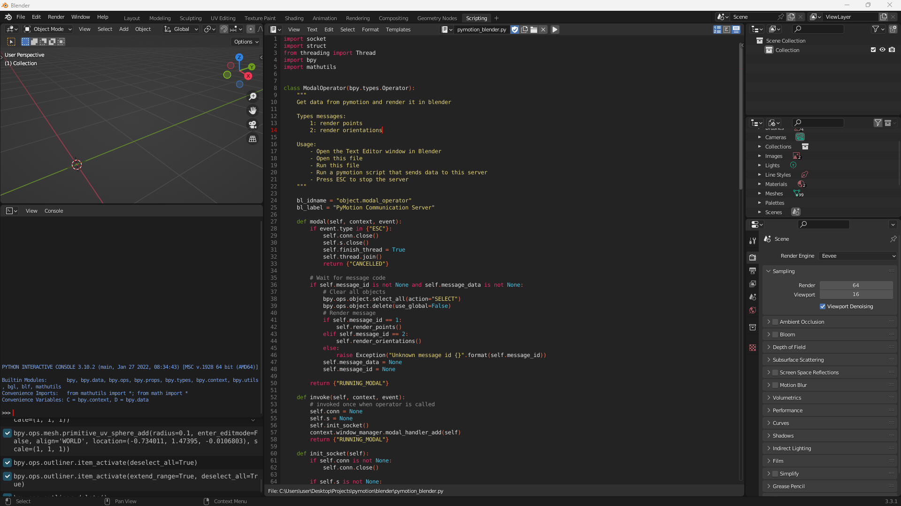

# PyMotion: A Python Library for Motion Data

PyMotion is a Python library that provides various functions for manipulating and processing motion data in NumPy or PyTorch. It is designed to facilitate the development of neural networks for character animation.

Some features of PyMotion are:

- A comprehensive set of quaternion operations and conversions to other rotation representations, such as rotation matrix, axis-angle, euler, and 6D representation
- A dual quaternion representation for rigid displacements, which can help neural networks better understand poses, as proposed by [Andreou et al. [2022]](https://doi.org/10.1111/cgf.14632) and later adopted by [Ponton et al. [2023]](https://upc-virvig.github.io/SparsePoser/)
- A continuous 6D rotation representation, as introduced by [Zhou et al. [2019]](https://doi.org/10.1109/CVPR.2019.00589)
- A BVH file reader and preprocessor for loading and transforming motion data
- Skeletal operations such as Forward Kinematics for computing global joint positions from local joint rotations
- [Beta] A blender visualizer for debugging and visualizing character animation
- NumPy and PyTorch implementations and tests for all functions

## Contents

1. [Installation](#installation)
2. [Examples](#examples)
3. [Roadmap](#roadmap)
4. [License](#license)

## Installation
1. **[Optional]** Install PyTorch using Pip as instructed in their [webpage](https://pytorch.org/get-started/locally/).

2. Install PyMotion:
```
pip install upc-pymotion
```

## Examples

<details>
<summary> Read and save a BVH file </summary>

```python
import numpy as np
from pymotion.io.bvh import BVH

bvh = BVH()
bvh.load("test.bvh")

print(bvh.data["names"])
# Example Output: ['Hips', 'LeftHip', 'LeftKnee', 'LeftAnkle', 'LeftToe', 'RightHip', 'RightKnee', 'RightAnkle', 'RightToe', 'Chest', 'Chest3', 'Chest4', 'Neck', 'Head', 'LeftCollar', 'LeftShoulder', 'LeftElbow', 'LeftWrist', 'RightCollar', 'RightShoulder', 'RightElbow', 'RightWrist']


# Move root joint to (0, 0, 0)
local_rotations, local_positions, parents, offsets = bvh.get_data()
local_positions[:, 0, :] = np.zeros((local_positions.shape[0], 3))
bvh.set_data(local_rotations, local_positions)

# Scale the skeleton
bvh.set_scale(0.75)

bvh.save("test_out.bvh")
```

</details>

<details>
<summary> Compute world positions and rotations from a BVH file </summary> <br/>

**NumPy**
```python
from pymotion.io.bvh import BVH
from pymotion.ops.forward_kinematics import fk

bvh = BVH()
bvh.load("test.bvh")

local_rotations, local_positions, parents, offsets = bvh.get_data()
global_positions = local_positions[:, 0, :]  # root joint
pos, rotmats = fk(local_rotations, global_positions, offsets, parents)
```

**PyTorch**
```python
from pymotion.io.bvh import BVH
from pymotion.ops.forward_kinematics_torch import fk
import torch

bvh = BVH()
bvh.load("test.bvh")

local_rotations, local_positions, parents, offsets = bvh.get_data()
global_positions = local_positions[:, 0, :]  # root joint
pos, rotmats = fk(
    torch.from_numpy(local_rotations),
    torch.from_numpy(global_positions),
    torch.from_numpy(offsets),
    torch.from_numpy(parents),
)
```

</details>

<details>
<summary> Quaternion conversion to other representations </summary> <br/>

**NumPy**
```python
import pymotion.rotations.quat as quat
import numpy as np

angles = np.array([np.pi / 2, np.pi, np.pi / 4])[..., np.newaxis]
# angles.shape = [3, 1]
axes = np.array([[1, 0, 0], [0, 1, 0], [0, 0, 1]])
# axes.shape = [3, 3]

q = quat.from_angle_axis(angles, axes)

rotmats = quat.to_matrix(q)

euler = quat.to_euler(q, np.array([["x", "y", "z"], ["z", "y", "x"], ["y", "z", "x"]]))
euler_degrees = np.degrees(euler)

scaled_axis = quat.to_scaled_angle_axis(q)
```

**PyTorch**
```python
import pymotion.rotations.quat_torch as quat
import numpy as np
import torch

angles = torch.Tensor([torch.pi / 2, torch.pi, torch.pi / 4]).unsqueeze(-1)
# angles.shape = [3, 1]
axes = torch.Tensor([[1, 0, 0], [0, 1, 0], [0, 0, 1]])
# axes.shape = [3, 3]

q = quat.from_angle_axis(angles, axes)

rotmats = quat.to_matrix(q)

euler = quat.to_euler(q, np.array([["x", "y", "z"], ["z", "y", "x"], ["y", "z", "x"]]))
euler_degrees = torch.rad2deg(euler)

scaled_axis = quat.to_scaled_angle_axis(q)
```

</details>

<details>
<summary> Root-centered dual quaternions from a BVH file </summary> <br/>

**NumPy**
```python
from pymotion.io.bvh import BVH
import pymotion.ops.skeleton as sk
import numpy as np

bvh = BVH()
bvh.load("test.bvh")

local_rotations, local_positions, parents, offsets = bvh.get_data()

root_dual_quats = sk.to_root_dual_quat(
    local_rotations, local_positions[:, 0, :], parents, offsets
)

local_translations, local_rotations = sk.from_root_dual_quat(root_dual_quats, parents)
global_positions = local_translations[:, 0, :]
offsets = local_translations.copy()
offsets[:, 0, :] = np.zeros((offsets.shape[0], 3))
```

**PyTorch**
```python
from pymotion.io.bvh import BVH
import pymotion.ops.skeleton_torch as sk
import torch

bvh = BVH()
bvh.load("test.bvh")

local_rotations, local_positions, parents, offsets = bvh.get_data()

root_dual_quats = sk.to_root_dual_quat(
    torch.from_numpy(local_rotations),
    torch.from_numpy(local_positions[:, 0, :]),
    torch.from_numpy(parents),
    torch.from_numpy(offsets),
)

local_translations, local_rotations = sk.from_root_dual_quat(root_dual_quats, parents)
global_positions = local_translations[:, 0, :]
offsets = local_translations.clone()
offsets[:, 0, :] = torch.zeros((offsets.shape[0], 3))
```

</details>

<details>
<summary> 6D representation from a BVH file </summary> <br/>

**NumPy**
```python
from pymotion.io.bvh import BVH
import pymotion.rotations.ortho6d as sixd

bvh = BVH()
bvh.load("test.bvh")

local_rotations, _, _, _ = bvh.get_data()

continuous = sixd.from_quat(local_rotations)

local_rotations = sixd.to_quat(continuous)
```

**PyTorch**
```python
from pymotion.io.bvh import BVH
import pymotion.rotations.ortho6d_torch as sixd
import torch

bvh = BVH()
bvh.load("test.bvh")

local_rotations, _, _, _ = bvh.get_data()

continuous = sixd.from_quat(torch.from_numpy(local_rotations))

local_rotations = sixd.to_quat(continuous)
```

</details>

<details>
<summary> Visualize a pose in Blender </summary> <br/>

1. Open the Test Exitor window in Blender
2. Open the the file ```blender/pymotion_blender.py``` that can be found in this repository
3. Run the script (Blender will freeze)


4. Run the following Python code in a seperate environment:
```python
from pymotion.io.bvh import BVH
from pymotion.ops.forward_kinematics import fk
from pymotion.visualizer.blender import BlenderConnection

bvh = BVH()
bvh.load("test.bvh")

local_rotations, local_positions, parents, offsets = bvh.get_data()
global_positions = local_positions[:, 0, :]  # root joint
pos, _ = fk(local_rotations, global_positions, offsets, parents)

# Render points
frame = 0
conn = BlenderConnection("127.0.0.1", 2222)
conn.render_points(pos[0])
conn.close()
```

5. Press ESC key in Blender to stop the server

</details>

## Roadmap

This repository is authored and maintained by [Jose Luis Ponton](https://github.com/JLPM22) as part of his Ph.D.

Features will be added when new operations or rotation representations are needed in the development of research projects. Here it is a list of possible features and improvements for the future:

- Extend documentation and add examples in the description of each function.
- Include new animation importers such as FBX
- Improve the usability of the Blender visualization workflow
- Include useful operations for data augmentation such as animation mirroring
- Create an Inverse Kinematics module

## License

This work is licensed under the MIT license. Please, see the [LICENSE](LICENSE) for further details.
